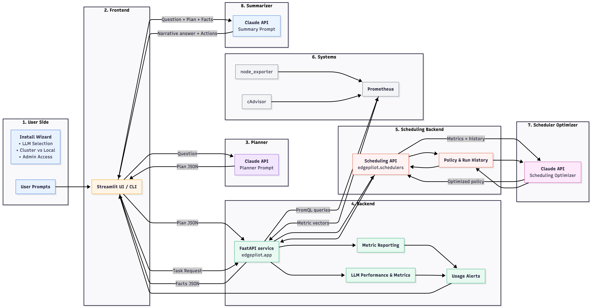

# EdgePilot Architecture Overview



## Layers

### 1. User Side
- **Install Wizard** collects deployment choices (Claude model, cluster vs. local, access) and lights up the Streamlit UI.
- **Prompts** capture ad-hoc questions after setup; every prompt becomes an input for the planner.

### 2. Frontend (Streamlit UI / CLI)
- Orchestrates the human loop: sends questions to the planner, renders plan JSON, raw facts, and summarized answers.
- Surfaces LLM usage/performance metrics emitted by the planner and summarizer alongside alert banners from the backend.

### 3. Planner (Claude)
- Translates natural language into strongly-typed plan JSON (`report`, `can_run`, `suggest_window`, `run_task`, etc.).
- Validates schema compliance before the plan is returned to the UI and relayed to the API.
- Emits latency, token, and error telemetry that feeds the LLM performance dashboard.

### 4. Backend
- **FastAPI (`edgepilot.app`)** materializes plan steps: composes PromQL, coordinates task execution, and persists run context.
- **Metric Reporting** aggregates resource usage and emits alerts when thresholds are exceeded.
- **Usage Alerts** are generated from metric reports and forwarded to the UI for operator follow-up.
- **LLM Performance & Metrics** tracks planner/summarizer behavior for observability.

### 5. Scheduling Backend
- **Scheduling API (`edgepilot.schedulers`)** handles task submissions destined for optimized execution.
- **Policy & Run History** captures prior job executions, chosen policies, and downstream outcomes for reuse.

### 6. Systems / Exporters
- **Prometheus, node_exporter, and cAdvisor** supply live system metrics that drive both reporting and scheduling analysis.

### 7. Scheduler Optimizer (Claude)
- Consumes current metrics plus historical policy data from the backend to synthesize an optimized scheduling strategy.
- Returns policy updates to the EdgePilot API so upcoming tasks run with the recommended configuration.

### 8. Summarizer (Claude)
- Consumes the original question, planner plan, and backend facts to craft the final narrative response.
- Adds recommended actions, confidence notes, and response metrics that contribute to usage alerts.

## Data Flow Summary
1. User installs EdgePilot, selects the Claude model, and launches the Streamlit UI/CLI.
2. A prompt is sent to the planner LLM; validated plan JSON returns to the UI and is forwarded to the API.
3. The FastAPI backend executes each step by issuing PromQL queries against Prometheus and streams execution signals to the scheduling API.
4. The scheduling backend gathers policy/run history, augments it with fresh metrics, and hands the package to the optimizer LLM.
5. The scheduler optimizer returns policy recommendations that the scheduling API applies to upcoming task requests.
6. EdgePilot runs requested jobs using the optimized policy while logging run context, usage metrics, and alert signals.
7. Planner and summarizer responses populate LLM performance metrics while the summarizer crafts the narrative answer and closes the loop with usage alerts.

## Environment & Configuration
- Credentials are managed via `.env` (`ANTHROPIC_API_KEY`, `CLAUDE_MODEL=claude-3-5-haiku-20241022`, `EDGE_BASE_URL`).
- `infra/docker-compose.yml` runs Prometheus, exporters, Grafana, and EdgePilot dependencies locally.
- `edgepilot/pipeline.py` houses reusable planner/executor/summarizer helpers leveraged by Streamlit and CLI flows.

## Streamlit Quick Start

1. **Install prerequisites**
   - Docker Desktop (Mac/Windows) or Docker Engine (Linux).
   - Python 3.8+ (the repo ships with a virtualenv in `edgepilot/.venv`).

2. **Clone the repository & enter the project**
   ```bash
   git clone <repo-url>
   cd Practicum
   ```

3. **Bootstrap the monitoring stack**
   ```bash
   docker-compose -f infra/docker-compose.yml pull
   docker-compose -f infra/docker-compose.yml up -d
   ```
   This launches Prometheus, node-exporter, cAdvisor, Grafana, and Alertmanager on the `monitoring` network.

4. **Create / activate the virtual environment**
   ```bash
   python3 -m venv edgepilot/.venv   # skip if already checked in
   source edgepilot/.venv/bin/activate
   pip install -r edgepilot/requirements.txt
   ```

5. **Configure environment variables**
   - Copy `.env` and populate:
     ```bash
     cp .env.example .env   # if provided; otherwise edit .env directly
     ```
   - Ensure the following variables are set (values shown for reference):
     ```bash
     export ANTHROPIC_API_KEY=sk-ant-...
     export CLAUDE_MODEL=claude-3-5-haiku-20241022
     export CLAUDE_MAX_TOKENS=1024
     export EDGE_BASE_URL=http://127.0.0.1:5057
     ```
   - To load automatically: `set -a && source .env && set +a` before each session, or place the exports in `~/.zshrc`.

6. **Start the EdgePilot API**
   ```bash
   uvicorn edgepilot.app:app --reload --port 5057
   ```
   Leave this process running (or use a supervisor such as `pm2`/`honcho`).

7. **Launch the Streamlit assistant** (new terminal, same venv/env)
   ```bash
   source edgepilot/.venv/bin/activate
   set -a && source .env && set +a
   streamlit run edgepilot/streamlit_app.py
   ```
   Open the URL shown in the terminal (`http://localhost:8501` by default).

8. **Optional: Grafana login**
   - Navigate to `http://localhost:3000`
   - Default credentials: `admin / admin123`
   - Add Prometheus data source: `http://prometheus:9090`

9. **Shut down services**
   ```bash
   docker-compose -f infra/docker-compose.yml down
   ```

## Troubleshooting

- `ModuleNotFoundError: edgepilot` when running Streamlit: ensure `edgepilot/streamlit_app.py` is invoked from project root (it adjusts `sys.path`), and the venv is active.
- Prometheus can’t reach Alertmanager: confirm the container is running (`docker ps`) and `prometheus/prometheus.yml` targets `alertmanager:9093`.
- Claude API errors (`model not found`, `missing API key`): double-check `.env` values and run `echo $ANTHROPIC_API_KEY` before launching the apps.
